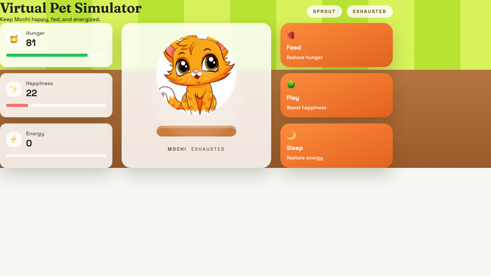
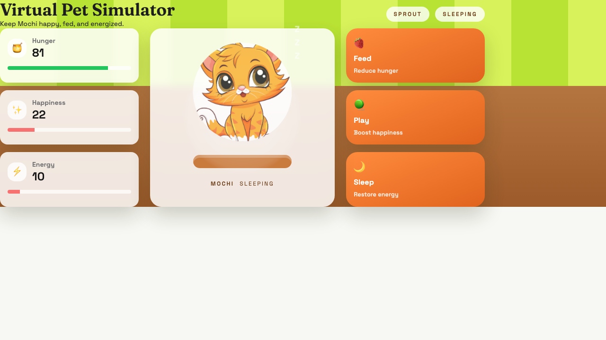

# Virtual Pet Simulator

## Project Overview
**Project Title:** Virtual Pet Simulator  
**Technologies:** HTML, CSS, JavaScript (implemented with React + Tailwind CSS)  
**Project Difficulty:** Hard  

**Project Description:**  
In this web development assignment, you will create a Virtual Pet Simulator using HTML, CSS, and JavaScript. The goal is to design an interactive web application that simulates the experience of taking care of a virtual pet. This project combines front-end development skills with user interaction.

---

## Project Requirements Checklist

1. **Virtual Pet Design**
   - Virtual pet character with a visual asset (cartoon cat image).
   - Attributes: hunger, happiness, energy.

2. **User Interface**
   - Engaging UI layout with pet and status indicators.
   - HTML structure + Tailwind CSS styling, animations, and transitions.

3. **Pet Interaction**
   - Feed, Play, Sleep actions.
   - Each interaction updates attributes (e.g., feed reduces hunger, play increases happiness).

4. **Attribute Display**
   - Progress bars/icons show hunger, happiness, energy.
   - Attributes update in real time as users interact.

5. **Pet Animation**
   - State-based animations:
     - Hungry → dull/sad tone
     - Happy → cheerful bounce
     - Sleeping → rolls over + Zzz
     - Play → toy shake + sparkle

6. **Game Logic**
   - Attributes change over time (decay).
   - State transitions (awake/sleeping/exhausted).

7. **Extra Features (Optional)**
   - Multiple pet types are supported in backend.

---

## Live Demo

- Frontend (Netlify): `https://virtual-cat-pet-simulator.netlify.app`
- Backend (Railway): `https://virtual-pet-simulator-production.up.railway.app`
- Health Check: `https://virtual-pet-simulator-production.up.railway.app/health`

---

## How To Run

### Environment Variables

Create these `.env` files before starting the app locally:

#### `backend/.env`
```env
MONGODB_URI=mongodb://localhost:27017/virtual-pet
CLIENT_ORIGIN=http://localhost:5173
PORT=5001
```

This repo also includes `backend/.env.example` as the Git-safe template. Copy it to `backend/.env` for local development, but do not commit your real secrets.

#### `frontend/.env`
```env
VITE_API_URL=http://localhost:5001
```

#### `frontend/.env.production`
```env
VITE_API_URL=https://virtual-pet-simulator-production.up.railway.app
```

### 1) Backend
```bash
cd "/Users/riyadebnathdas/Desktop/Projects/Virtual Pet Simulator/backend"
npm install
npm run dev
```

### 2) Frontend
```bash
cd "/Users/riyadebnathdas/Desktop/Projects/Virtual Pet Simulator/frontend"
npm install
npm run dev
```

---

## How To Play
1. Click **Feed** → reduces hunger.
2. Click **Play** → increases happiness, decreases energy.
3. Click **Sleep** → restores energy, cat rolls over and snoozes.

---

## Feature Screenshots
### 1) Dashboard


### 2) Feed Action


### 3) Play Action


### 4) Sleep Action


---

## Netlify Deployment (Frontend)
1. Push this project to a Git repository.
2. In Netlify, create a new site from the repository.
3. Build settings:
   - Base directory: `frontend`
   - Build command: `npm run build`
   - Publish directory: `dist`
4. Production API configuration:
   - This repo includes `frontend/.env.production` with the Railway backend URL.
   - If you prefer managing it in Netlify, set `VITE_API_URL` to your Railway backend URL.
5. Deploy the site.

---

## Railway Deployment (Backend)
1. Push this project to a Git repository.
2. In Railway, create a new project and deploy from the same repo.
3. The repo now includes a root-level `Dockerfile`, so Railway can build the backend directly from the Git repo root even if the service root directory is left blank.
4. If you prefer using a root directory, set Railway Root Directory to `backend`. In that case, Railway will not automatically follow `backend/railway.json`; set the config file path in Railway to `/backend/railway.json` if you want that file to be used.
5. Environment variables:
   - `MONGODB_URI` = your MongoDB Atlas URI
   - `CLIENT_ORIGIN` = your frontend site URL
   - `PORT` = do not set manually on Railway unless required; Railway provides it automatically
6. Do not commit the real `backend/.env` file. Keep secrets in Railway variables only.
7. The backend exposes:
   - `/` = basic service info
   - `/health` = health check
   - `/api/pet` = pet API
8. Deploy and copy the generated Railway public domain.

---

## Submission Requirements
- Submit the project as a ZIP containing HTML, CSS, and JavaScript files.
- Include this `README.md` with instructions for running and interacting with the pet.

---

## Grading Criteria
- **Functionality:** Does it simulate pet care effectively?
- **User Interface:** Is the UI appealing and user-friendly?
- **Code Quality:** Is the code structured and readable?
- **Additional Features:** Bonus points for extra features.

---

## Assets
- Cat image: `frontend/src/assets/cvqx_lkdr_230628.jpg`

---

## Notes
- This project uses React + Tailwind CSS but meets HTML/CSS/JS requirements.
- Backend persistence uses MongoDB.
